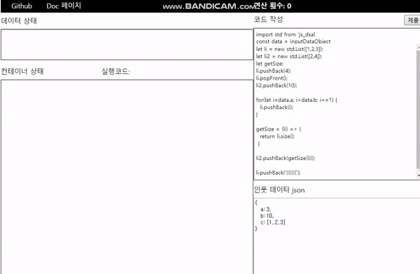

# **Javascript Data Structure**
javascript in-memory data structure for server side development.

### **Document Homeage** [Go Document](https://hongjisung.github.io/DataStructure/)

## **Visualization**
Visualization is developed in other repository  
[Visualization Repository](https://github.com/hongjisung/JS_DataStructure_Visualization)

### **Homepage Address** [Go HomePage](https://hongjisung.github.io/JS_DataStructure_Visualization/)  



## **Containers**
- ### **List**  
  Doubly linked list.  
  
- ### **Stack**   
  Based on Array.  

- ### **Queue**  
  Based on circular array.     
  
- ### **Priority queue**
  Based on Array.  
  Sorted by Compare function basically descending order.  

- ### **Deque**    
  Deque extends Queue.  
  Based on circular array.  
  pop and push method are assumed as private.

- ### **SetTree**  
  Red black tree with unique value.   
  Identify key with data.  
  Sorted by Compare function basically descending order.

- ### **MultiSetTree**
  Red black tree.  
  Identify key with data.  
  Sorted by Compare function basically descending order.

- ### **MapTree**  
  Red black tree with unique value.  
  key and data mapping structure.  
  Sorted by Compare function basically descending order.  

- ### **MultiMapTree**  
  Red black tree.  
  key and data mapping structure.  
  Sorted by Compare function basically descending order.  

## **Algorithms**
- ### **MergeSort**
  Sort iterable object in O(nlogn) times.
  Sorting time almost similar in most cases.

- ### **QuickSort**
  Sort iterable object in average O(nlogn) times.
  Sorting time is not stable.

- ### **removeCondition**
  remove elements which data or key satisfies the condition in iterable container.

- ### **unique**
  reduce duplicate elements to one in iterable container.

- ### **findNodes**  
  This can find several keys at one time.  
  It return an array of the matched nodes.  

- ### **map**  
  This can apply function to data of elements in container.  
  It cannot use for set, because set is key and data are equal and is sorted by key.  

## **Graph**
- ### **DirectedGraph**
  directed graph based on adjacent list concept
- ### **UndirectedGraph**
  undirected graph based on adjacent list concept

## **Reference**
- ### [c++ stl](http://www.cppreference.com)
- ### [Red Black Tree](https://en.wikipedia.org/wiki/Red%E2%80%93black_tree)
- ### [Quick Sort](https://en.wikipedia.org/wiki/Quicksort)
- ### [Merge Sort](https://en.wikipedia.org/wiki/Merge_sort)


# **Install**
**Install dependencies**
```
npm install
```

**Run Test**
```
npm run test
```

**Make jsdoc homepage html**
```
mkdir doc
npm run doc // open the ./doc/index.html
```

**Use template in this git folder**
```javascript
const std = require('./src');
```

**Use template in other folder**
```
npm install <directory path>
```

# **Function Tables**
## **Container Member Function Table**
| Method | List | Stack | Queue | Deque | PriorityQueue | SetTree | MultiSetTree | MapTree | MultiMapTree |
| ------ | ---- | ----- | ----- | ----- | ------------- | ------- | ------------ | ------- | ------------ |
| **(constructor)** | List() | Stack() | Queue() | Deque() | PriorityQueue() | SetTree() | MultiSetTree() | MapTree() | MultiMapTree() |
| **compare** | compare() | compare() | compare() | compare() | | | | | |
| **Iterators** | | | | | | | | | |
| **begin** | begin() | | | | | begin() | begin() | begin() | begin() |
| **rbegin** | rbegin() | | | | | rbegin() | rbegin() | rbegin() | rbegin() |
| **end** | end() | | | | | end() | end() | end() | end() |
| **rend** | rend() | | | | | rend() | rend() | rend() | rend() |
| **Element Access** | | | | | | | | | |
| **front** | front() | | front() | front() | top() | | | | |
| **back** | back() | top() | back() | back() | | | | | |
| **Capacity** | | | | | | | | | |
| **empty** | empty() | empty() | empty() | empty() | empty() | empty() | empty() | empty() | empty() |
| **size** | size() | size() | size() | size() | size() | size() | size() | size() | size() |
| **Modifier** | | | | | | | | | |
| **clear** | clear() | | clear() | clear() | | clear() | clear() | clear() | clear() |
| **insert** | insert() | | | | | insert() | insert() | insert() | insert() |
| **assign** | | | | | | | | assign() | assign() |
| **insertOrAssign** | | | | | | | | insertOrAssign() | insertOrAssign() |
| **erase** | erase() | | | | | erase() | erase() | erase() | erase() |
| **pushFront** | pushFront() | | | pushFront() | | | | | |
| **pushBack** | pushBack() | push() | push()| pushBack() | push() | | | | |
| **popFront** | popFront() | | pop()| popFront()| pop() | | | | |
| **popBack** | popBack() | pop() | | popBack() | | | | | |
| **merge** | merge() | | | | | | | | |
| **List operations** | | | | | | | | | |
| **splice** | splice() | | | | | | | | |
| **reverse** | reverse() | | | | | | | | |
| **sort** | sort() | | | | | | | | |
| **Lookup** | | | | | | | | | |
| **count** | | | | | | count() | count() | count() | count() |
| **find** | | | | | | find() | find() | find() | find() |
| **contains** | | | | | | contains() | contains() | contains() | contains() |
| **lowerBound** | | | | | | lowerBound() | lowerBound() | lowerBound() | lowerBound() |
| **upperBound** | | | | | | upperBound() | upperBound() | upperBound() | upperBound() |
| **equalRange** | | | | | | equalRange() | equalRange() | equalRange() | equalRange() |
| **keyComp** | | | | | compareFunction() | keyComp() | keyComp() | keyComp() | keyComp() |

## **Node Member Function Table**
| Method  | Node(list) | TreeNode |
| ------- | ---------- | -------- |
| getData | getData()    |          |
| setData | setData(data)    |          |
| getKey  |            | getKey()   |
| getValue |            | getValue()   |
| getPrev | getPrev()    | getPrev()  |
| getNext | getNext()    | getNext()  |

## **Algorithm Container Table**
| Function | List | SetTree | MultiSetTree | MapTree | MultiMapTree |
| -------- | ---- | ------- | ------------ | ------- | ------------ |
| **mergeSort** | mergeSort(List)  |         |              |         |              |
| **quickSort** | quickSort(List)  |         |              |         |              |
| **removeCondition** | removeCondition(function) | removeCondition(function) | removeCondition(function) | removeCondition(function) | removeCondition(function) |
| **unique** | unique(List) | | unique(MultiSetTree) |         | unique(MultiMapTree) |
| **findNodes** | findNodes(List, key array) | findNodes(SetTree, key array) | findNodes(MultiSetTree, key array) | findNodes(MapTree, key array) | findNodes(MultiMapTree, key array) |
| **map** | map(List, function)  | | | map(MapTree, function) | map(MultiMapTree, function) |


# **Usage**
## **Containers**
### [**Container Usage Examples**](https://github.com/hongjisung/DataStructure/tree/master/src/containers)

## **Algorithms**
### [**Algorithm Usage Examples**](https://github.com/hongjisung/DataStructure/tree/master/src/algorithms)

  
  

## **Data Structure Operation Time Complexity**
| **Container**      | Search | Insertion | Deletion | Remarks                  |
| ------------------ | ------ | --------- | -------- | ------------------------ |
| **List**           | n      | 1         | 1        |                          |
| **Stack**          | n      | 1         | 1        |                          |
| **Queue**          | n      | 1         | 1        |                          |
| **Priority Queue** | N/A    | log(n)    | log(n)   | Access O(1) for the Top  |
| **Deque**          | n      | 1         | 1        |                          |
| **SetTree**        | log(n) | log(n)    | log(n)   |                          |
| **MultiSetTree**   | log(n) | log(n)    | log(n)   | Deletion is different according the number of same key |
| **MapTree**        | log(n) | log(n)    | log(n)   |                          |
| **MultiMapTree**   | log(n) | log(n)    | log(n)   | Deletion is different according the number of same key |

## **Algorithm operation time complexity**
| Operation  | Best    | Average | Worst   | Space  |
| ---------- | ------- | ------- | ------- | ------ |
| **Merge Sort** | nlog(n) | nlog(n) | nlog(n) | n      |
| **Quick Sort** | nlog(n) | nlog(n) | n<sup>2 | log(n) |

# **Jsdoc**  
**Template :** docdash  
**Make document command :** npm run doc

# **Eslint**
**Style :** airbnb

# **Test**
**Test FrameWork :** Mocha  
**Test command :** npm run test